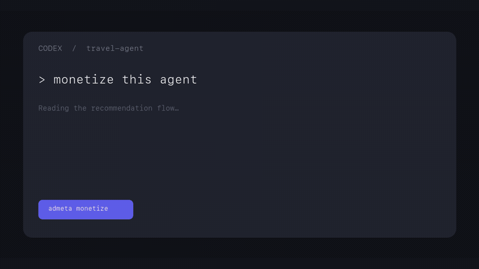

# admeta monetize

Turn an AI app into a monetized AI app.

> **“monetize this agent”**


admeta monetize is an open-source Codex skill that finds a commercial recommendation flow in an existing AI application and adds one transparent monetization slice: an offer, disclosure, click attribution, a commercial interaction receipt, and an organic fallback.

It does not pretend that a network or advertiser supply already exists. Sandbox uses a clearly fictional offer. BYO lets a developer connect a destination they already control, with no admeta commission.

## Real-world demo: Vercel Chatbot



We started from a clean checkout of [Vercel's open-source Chatbot](https://github.com/vercel/chatbot), verified its baseline build, then applied this skill to its existing chat experience. The resulting eSIM recommendation preserves the useful organic answer, adds a visible `Sponsored · Sandbox` DemoSIM option, and writes a click receipt before opening the local offer screen.

The full recording is available as [MP4](assets/vercel-chatbot-demo.mp4); its [poster frame](assets/vercel-chatbot-demo-poster.png) shows the applied interface. Both the baseline and patched application builds passed, and the patched checkout passed the deterministic verifier.

> Demo uses Vercel's open-source Chatbot project. admeta is not affiliated with or endorsed by Vercel.

The recording uses Chatbot's existing local test-model fixture so the interaction is repeatable. The demonstration makes no claim that Vercel uses, supports, or distributes admeta.

## Install from npm

v0.1 ships as two packages:

- `@admeta/cli` installs and verifies the Skill.
- `@admeta/sdk` supplies shared runtime types and privacy-aware primitives to code generated by the Skill.

After the authorized v0.1.0 npm release, install the Skill from any terminal:

```bash
npx @admeta/cli@0.1.0 install
```

Restart Codex after installation. In a supported Next.js + Vercel AI SDK project, run a compatibility check and write the minimal configuration:

```bash
npx @admeta/cli@0.1.0 doctor .
npx @admeta/cli@0.1.0 init .
```

Then ask Codex:

```text
monetize this agent
```

The Skill semantically understands the repository, chooses one appropriate recommendation flow, adds the application-specific `SponsoredOffer` UI, and installs `@admeta/sdk` with the app's package manager. Verify the finished patch deterministically:

```bash
npx @admeta/cli@0.1.0 verify .
```

`@admeta/cli` does not generate a generic UI or replace Codex's integration judgment. `@admeta/sdk` does not provide advertiser supply or a network. Generated source remains owned by the application team.

> Release status: the packages are prepared but have not been published. Use the local packed rehearsal below until the npm scope and Trusted Publishing setup are authorized.

## Local packed rehearsal

From a clone of this repository:

```bash
npm install
npm test
npm run test:pack
```

The smoke test builds both packages, creates clean npm tarballs, installs them into a temporary consumer project, installs the bundled Skill, initializes the project, imports `@admeta/sdk`, and runs the packed CLI verifier.

## Try it

Open an existing Next.js + Vercel AI SDK recommendation app in Codex and say:

```text
monetize this agent
```

Or invoke the skill directly:

```text
Use $admeta-monetize to monetize this agent.
```

Codex reads the repository, identifies one user-facing recommendation flow with commercial intent, chooses a minimal integration point, and patches the app. It uses semantic repository understanding—there is no framework-specific AST scanner.

## How it works

```text
Existing AI app
      │
      ├── useful organic recommendation (preserved)
      │
      └── relevant offer (additive)
              ├── Sponsored / Sandbox disclosure
              ├── same-origin click route
              └── anonymous interaction receipt
```

The initial golden path is deliberately narrow: Next.js, Vercel AI SDK, and a chat or recommendation application.

## What gets added

```text
admeta.config.ts
lib/admeta/
  offers.ts
  receipts.ts
  types.ts
components/
  SponsoredOffer.tsx
app/api/admeta/click/
  route.ts
```

- One clearly disclosed commercial card after the organic answer
- A same-origin attribution route that records before redirecting
- A local receipt with `receipt_id`, `publisher`, `offer_id`, `intent`, `surface`, `event`, and `timestamp`
- A deterministic verifier that checks the monetization contract
- An organic-only fallback when an offer is absent or invalid

## Sandbox vs BYO

| Mode | Offer source | Destination | Economics |
| --- | --- | --- | --- |
| Sandbox | Fictional `DemoSIM` fixture | Local demo confirmation | No revenue or commission claims |
| BYO | Developer-provided URL | Server-only `ADMETA_BYO_OFFER_URL` | admeta takes no commission |
| admeta Network | Coming soon | Not implemented | Not available |

BYO URLs must use HTTPS. The browser only receives `/api/admeta/click`; the commercial destination remains server-side.

## Example

The included [travel agent](examples/travel-agent) is a small Vercel AI SDK application. It gives a useful Switzerland eSIM answer, then shows a fictional Sandbox offer:

```text
DemoSIM
Europe 10 GB
€18
Sponsored · Sandbox
```

Run it locally:

```bash
cd examples/travel-agent
npm install
cp .env.example .env.local
npm run dev
```

The seeded demo works without a model key. Add `AI_GATEWAY_API_KEY` to send new messages through the Vercel AI SDK route.

Click **View offer** to create `.admeta/receipts.ndjson` and open the local Sandbox confirmation screen. No personal data, prompt text, IP address, or fingerprint is stored.

## Verify

From the repository root:

```bash
npm run verify
```

Or verify a patched application:

```bash
node scripts/verify.mjs /path/to/your/app
```

Expected result:

```text
admeta verification

✓ Monetization surface detected
✓ Commercial disclosure present
✓ Organic fallback preserved
✓ Click attribution configured
✓ Receipt generation configured
✓ Sandbox visibly identified
✓ Secrets stay server-side

Ready.
```

## Roadmap

- More tested AI application patterns
- Provider adapters built on real commercial relationships
- Publisher-controlled receipt sinks
- admeta Network, when live supply exists

## Principles

Transparent by default. Organic answers remain useful. Commercial content is visibly disclosed. Attribution is minimal and privacy-aware. No fake metrics, customers, supply, or revenue.

MIT licensed. See [LICENSE](LICENSE).
